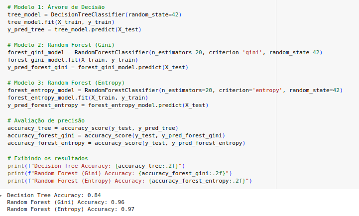

This is a proof-of-concept project with no means to be a fully-fledged product.

This demonstrates the concept of a random forest and decision tree. It was created as part of an elective course on Advanced Topics in Artificial Intelligence for Catholic University of Pernambuco.

The model is trained with [Digits dataset](https://scikit-learn.org/1.5/auto_examples/datasets/plot_digits_last_image.html) which is a small but concise

Although you can take a photo on the website, it must fit perfectly as the model was trained to be viewed in a specific way.
As you can see, I chose Random Forest because it improves accuracy compared to a decision tree.

[Live Demo](https://random-forest-guess-number.vercel.app/)

### Tech Stack
Vue 3
Python
Railway

